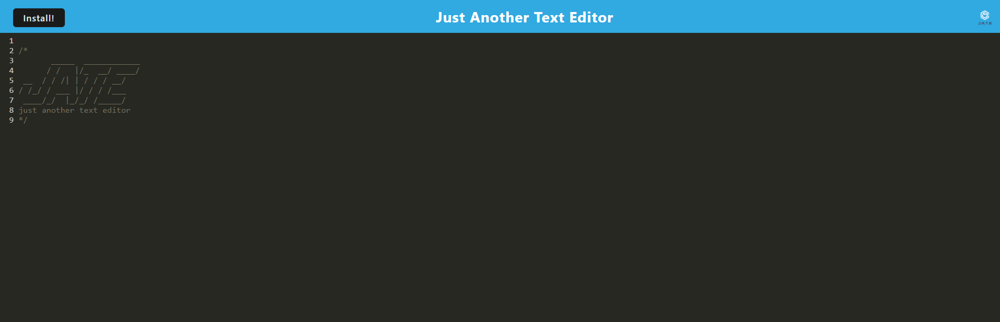

# Progressive Web App JATE




## Description
A live text editor that uses javascript to save data to a database. Can be installed for offline functionality.

## Table of Contents
- [Description](#description)
- [Installation](#installation)
- [Usage](#usage)
- [Tests](#tests)
- [Questions](#questions)

## Installation
```
Simply click the install file on the top left of the web page
```

## Usage
It stores text data in javascript format for later use.

## Tests
Run the application using the inspect tool on the browser to record console log errors.

## Questions
If you have any questions please go to my github:
https://github.com/SleekWingX 